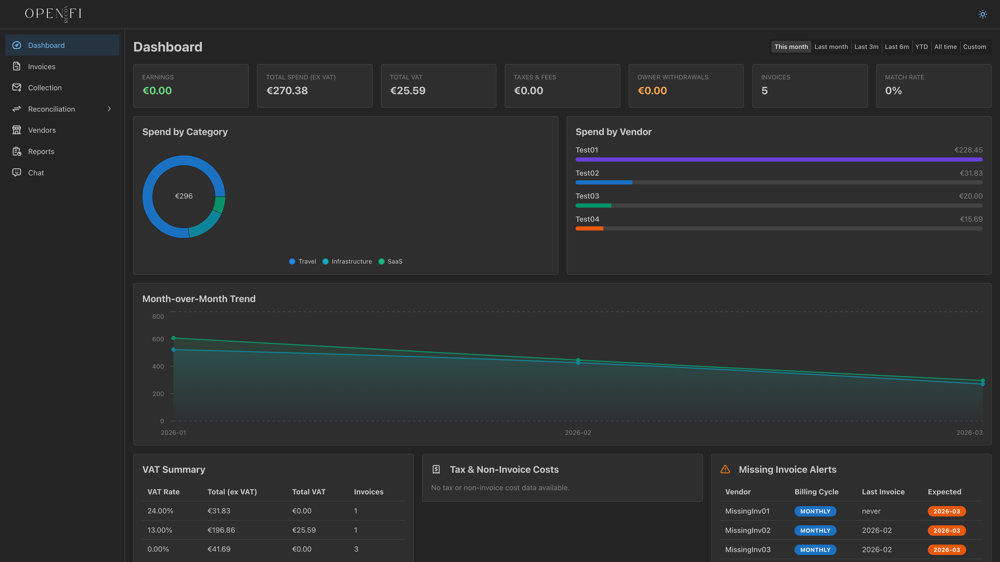

# OpenReconFi

Self-hosted agency finance ops — invoice collection, bank reconciliation, vendor management, reports, and AI-powered expense chat.

OpenReconFi automates the tedious parts of agency bookkeeping: it pulls invoices from Gmail, extracts metadata with Claude, reconciles them against bank statements using LLM matching, and gives you an interactive chat interface to query your financial data.



## Features

- **Invoice Collection** — Syncs Gmail for invoices, extracts metadata via Claude, organizes in Google Drive
- **Bank Reconciliation** — Parses XLS/CSV/MT940/CAMT.053 statements, LLM-matches transactions to invoices with confidence scoring
- **Vendor Management** — Track vendors, billing cycles, aliases, and detect missing invoices
- **Financial Reports** — Generate PDF/Excel reports by month, quarter, YTD, or custom range
- **Expense Chat** — RAG-powered AI chat over your financial data with streaming responses
- **Dashboard** — Spend breakdowns, VAT summaries, month-over-month comparisons, and alerts

## Tech Stack

| Layer | Stack |
|---|---|
| **Backend** | Python 3.13, FastAPI, SQLAlchemy (async), PostgreSQL + pgvector, Alembic |
| **Frontend** | React 19, TypeScript, Vite, Mantine UI, Redux Toolkit (RTK Query) |
| **AI** | Anthropic Claude (extraction, parsing, matching, chat), OpenAI (embeddings) |
| **Integrations** | Gmail API, Google Drive API |
| **Infrastructure** | Docker, Docker Compose |

## Quick Start

### Prerequisites

- Docker & Docker Compose
- API keys: [Anthropic](https://console.anthropic.com/) + [OpenAI](https://platform.openai.com/)
- Google Cloud project with Gmail API + Drive API enabled

### 1. Clone and configure

```bash
git clone <repo-url> && cd openreconfi
cp Backend/.env.example Backend/.env
# Fill in your API keys and Google OAuth credentials (see Backend README)
```

### 2. Start everything

```bash
docker compose up --build
```

This starts all three services:

| Service | URL | Description |
|---|---|---|
| **Frontend** | http://localhost:3000 | React app (nginx) |
| **Backend** | http://localhost:8000/docs | FastAPI (Swagger UI) |
| **Postgres** | localhost:5432 | PostgreSQL + pgvector |

The frontend proxies `/api/*` requests to the backend automatically.

### Development mode

**Option A — Full Docker (no hot reload):**

```bash
docker compose up -d --build
```

Open http://localhost:3000. All three services run in Docker.

**Option B — DB in Docker, BE + FE local (hot reload):**

```bash
# Start only the database
docker compose up -d postgres

# Start the backend (from Backend/)
cd Backend
uv sync
uv run alembic upgrade head
uv run uvicorn app.main:app --host 0.0.0.0 --port 8000 --reload

# Start the frontend (from Frontend/, in another terminal)
cd Frontend
pnpm install
pnpm dev
```

Open http://localhost:5173. Vite proxies `/api/*` to the backend on `:8000` with hot module replacement on both sides.

For deploying to a Raspberry Pi or other local server via Portainer, see [DEPLOY_LOCAL.md](DEPLOY_LOCAL.md).

## Project Structure

```
openreconfi/
├── Backend/               # FastAPI application
│   ├── app/               # Main app (routers, services, models, schemas)
│   ├── alembic/           # Database migrations
│   ├── tests/             # pytest-asyncio test suite
│   ├── scripts/           # Utility scripts (OAuth, backfill, etc.)
│   └── Dockerfile
├── Frontend/              # React SPA
│   ├── src/
│   │   ├── features/      # Feature modules (dashboard, invoices, chat, etc.)
│   │   ├── store/         # RTK Query API slices
│   │   └── components/    # Shared components
│   ├── Dockerfile
│   └── package.json
├── docker-compose.yml     # Full-stack orchestration
└── openapi.json           # Auto-generated OpenAPI spec
```

See the individual READMEs for detailed setup and development guides:

- **[Backend README](Backend/README.md)** — API setup, environment variables, Google OAuth flow, testing, project structure
- **[Frontend README](Frontend/README.md)** — Development, build, feature modules, API client generation, testing
